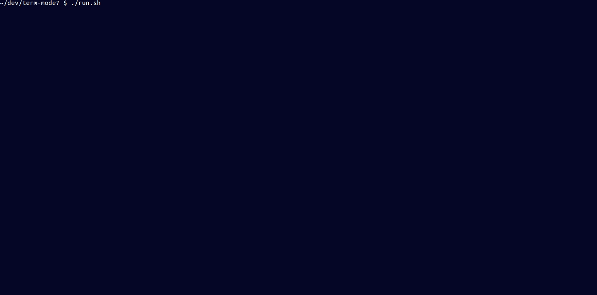
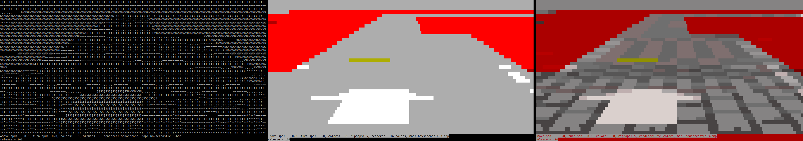

[](http://unmaintained.tech/)




This is a terminal, character based, rendering demo which features a SNES's mode7 like rendering a la Super Mario Kart.

DISCLAIMER: This demo is distributed under MIT license. However the images used by this demo are copyrighted by Nintendo and this is why they are not part of the distribution.  
You will get them at [build step](#build) from a [fan website](http://www.mariouniverse.com).

## Building & running

### Compatibility

Developed and tested on x86-64 Linux (Ubuntu 16.04). I guess it should work on other Unix-like 64-bit systems.

### Dependencies

ImageMagick (to convert PNG images to BMP v3) and libncurses development package are required to build this demo.

For example on Ubuntu 16.04:

```shell
sudo apt-get install imagemagick libncurses5-dev
```

### Build

This script will fetch required images from [http://www.mariouniverse.com](http://www.mariouniverse.com) and build the demo.

```shell
./build.sh
```

### Run

```shell
./run.sh
```

### 256 color mode

256 color mode might not works, according to your terminal capabilities, configuration or if you use a terminal multiplexer like tmux.

If your terminal supports 256 color mode, please note that this demo will change your terminal color palette without any possibility to restore it, see [here](https://stackoverflow.com/questions/36051061/color-not-ended-in-curses) for more details.  
**This is why you should run this demo in a dedicated terminal.**

## Controls

- q: quit
- arrow keys: move forward/backward and turn
- v & b: decrease & increase zoom
- p: toggle perspectives
- c: reset view (position, zoom, orientation)
- g: change renderer
- h & j: decrease & increase mipmap level count
- k & l: decrease & increase color count
- m: change map

## Technical notes

### Low fill rate & rendering latency mitigation

Terminals seems to be not optimized to render large amount of character changes. On my GNOME Terminal the fill rate is about 10K character changes per second (which means 1.5fps for a 160x80 screen).  
Furthermore, terminal rendering is asynchronous, which means:
- ncurses's `refresh()` does not block, it returns while terminal rendering is potentially not yet finished or even started (for the current frame).
- there is AFAIK no way to get feedback on terminal rendering status. It is therefore impossible to measure the real FPS or fill rate.
- when user rendering loop is faster than asynchronous terminal rendering, the terminal buffer size increases as well as rendering latency.
- when terminal buffer limit is reached, frames (character changes) start to be skipped until there is enough space in buffer.

This is why several techniques are combined to mitigate rendering latency:
- sleep for 5ms per frame: to limit a bit user rendering loop fill rate.
- texture quantization: to decrease overall texture details.
- level of detail via texture mipmapping: by default 5 mipmap levels (1024x1024 to 64x64) are used for rendering to reduce the level of detail according to the distance (= image row).
- color interleaving: only 1/13th of colors are rendering for each frame to minimize the rendered color count per frame. Of course the downside is that it increases latency for some pixels and generate annoying persistence effect when moving the camera.

### Input latency

For some keys (arrow keys) I emulate press/release events from non blocking `getch()` calls with acceleration handling to get smooth controls, but it fails in many ways.  
This is why you will observe weird behaviors around arrow keys input like latency or ignored event.
